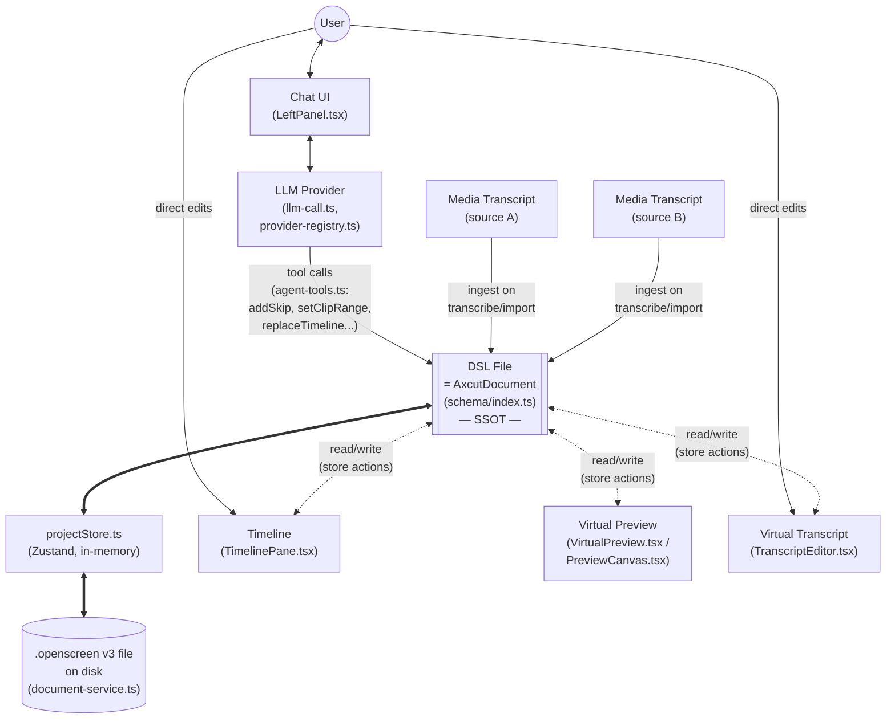

# AI-Edition — Data Flow

Companion to [`ai-edition-roadmap.md`](ai-edition-roadmap.md) (status/phasing) and
[`ai-edition-collision-analysis.md`](ai-edition-collision-analysis.md) (why decisions were
made). This doc answers a narrower question: **what talks to what, and who owns the truth**,
transcribed from a whiteboard sketch and cross-checked against the current code
(`feat/ai-edition`, 2026-07-02).

## 1. Diagram

## 2. What each node is, in code

| Sketch label | Code | Notes |
|---|---|---|
| **DSL File / SSOT** | `AxcutDocument` — Zod schema in `src/lib/ai-edition/schema/` | `project · assets[] · transcripts[] · timeline{clips,gaps,skip/mute/speed/captionRanges} · annotations[] · zoomRanges[] · legacyEditor · agent · preview · export · history`. Every pane below is a **view over this one document** — nothing keeps its own parallel state. |
| **DSL (persistence)** | `store/projectStore.ts` (Zustand, renderer) + `electron/ai-edition/document-service.ts` (main process) | Renderer holds the live document in a Zustand store; main process persists it to `userData/projects/<id>.axcut`. Legacy `.openscreen` v2 files migrate to v3 on first open (`lib/ai-edition/document/migrate*.ts`). |
| **Chat** | `src/components/ai-edition/LeftPanel.tsx` | Sends user messages to the LLM via IPC into `electron/ai-edition/chat-service.ts`. |
| **LLM** | `electron/ai-edition/llm-call.ts` + `provider-registry.ts` | Fetch-based calls, OpenAI-compatible + Anthropic today (8 providers registered; OAuth device-flow/PAT still stubbed — roadmap P2.2). |
| **Edits (LLM → DSL)** | `electron/ai-edition/agent-tools.ts` + tool-loop in `chat-service.ts` | The model doesn't free-write the document; it calls a fixed tool schema (`getCurrentDocument`, `getTranscript`, `addSkip`, `setSkipRange`, `setClipRange`, `replaceTimeline`, …). Each tool call is validated, applied to the store, and checkpointed first so the user can undo a whole batch (roadmap P1.1–P1.8). |
| **Media Transcript(s)** | Local Whisper (`@xenova/transformers`, in-browser, not gated by `AI_FEATURES_ENABLED`) | Produces `transcripts[]` entries keyed to an asset. The two boxes in the sketch are two independent transcript sources (e.g. two recorded assets / mic + system audio) that both land in the same document — there's no per-source document fork. |
| **Timeline** | `src/components/ai-edition/TimelinePane.tsx` | Renders `timeline.clips` + lanes (skip/speed/annotation/zoom ranges). Read/write against the store; drag, resize, reorder all dispatch store actions that mutate the DSL document (see roadmap §5 P0 table for the viewport/zoom/pan mechanics). |
| **Virtual Preview** | `VirtualPreview.tsx` / `PreviewCanvas.tsx` | Renders the composited frame (wallpaper, blur, webcam PiP, cursor overlay, zoom, annotations) by reading the document at the current playhead time — it never owns edit state, only projects it. |
| **Virtual Transcript** | `TranscriptEditor.tsx` | Editable view of `transcripts[]`; user edits here write back into the DSL document (word-level edits, not a separate buffer). |

## 3. Read this diagram as two loops

1. **Human loop** — User edits the Timeline / Transcript directly, or talks to the Chat panel,
   which drives the LLM, which edits the DSL document through the tool schema (never raw JSON
   patches). Both paths converge on the same document.
2. **Machine loop** — Media assets get transcribed locally (Whisper) and merged into the
   document's `transcripts[]`. Preview and Timeline are pure projections of the document at a
   given time/zoom — there is no independent "preview state" to desync from the DSL.

The one-document-many-views design is why the sketch draws `DSL File` as the hub: every arrow
either writes into it (Chat/LLM tool calls, direct user edits, transcript ingestion) or reads a
projection out of it (Timeline, Virtual Preview, Virtual Transcript). Persistence
(`projectStore.ts` ↔ `.openscreen` file) is a straight serialize/deserialize of the same shape,
not a separate model.

## 4. Open gaps vs. this flow (see roadmap §5 for detail)

- Chat history is still in-memory per session (`chat-service.ts`), not persisted to SQLite —
  roadmap P2.1.
- LLM auth is API-key only; OAuth device-flow/PAT is stubbed — roadmap P2.2.
- Streaming responses (SSE-style token rendering in Chat) not implemented — roadmap P2.4.
- Tool-call permission gate (confirm before a write tool runs) not implemented — roadmap P2.5.
