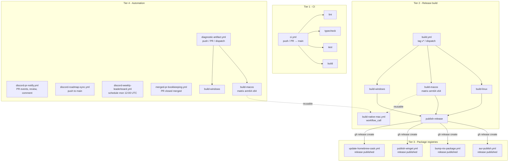

# GitHub Actions workflows

## Overview

The repository uses 13 workflow files across four functional tiers. This document describes the triggers, job dependencies, and artifact flow for each tier.

## Workflow dependency graph



## Tier 1: CI checks

**File:** `ci.yml`

Triggered on every push to `main` and every pull request targeting `main`. Four parallel, independent jobs with no interdependencies:

| Job | Runner | Purpose |
|---|---|---|
| `lint` | ubuntu-latest | Biome check |
| `typecheck` | ubuntu-latest | `tsc --noEmit` |
| `test` | ubuntu-latest | Vitest unit tests + Playwright browser tests |
| `build` | ubuntu-latest | `vite build` (renderer-only, no electron-builder) |

All jobs use the shared composite action `.github/actions/setup` for Node.js installation and `npm ci`. Failure of one job does not cancel the others.

## Tier 2: Release build and publish

### build-native-mac.yml

Reusable workflow triggered via `workflow_call`. Accepts an `arch` input (`arm64` or `x64`) and produces native ScreenCaptureKit helpers. Called by both `build.yml` (release packaging) and `diagnostic-artifact.yml` (diagnostic bundle). This workflow is not triggered by repository events directly.

### build.yml

Triggered by version tags (`v*`) or manual `workflow_dispatch` (with optional macOS architecture selection and release tag override).

**Jobs:**

1. **`build-windows`** (windows-latest): Compiles NSIS installer via `electron-builder --win`. Uploads artifact `openscreen-windows` (30-day retention).

2. **`build-macos`** (macos-latest, matrix `arm64` / `x64`): Compiles native helpers, runs `tsc && vite build`, builds `.app` bundle, creates and signs a DMG. Uploads artifacts `openscreen-mac-arm64` and `openscreen-mac-x64` (30-day retention). Signing and notarization are conditional on the presence of Apple developer secrets (`MAC_CERTIFICATE_P12`, `APPLE_ID`, etc.). Without secrets, produces an unsigned DMG.

3. **`build-linux`** (ubuntu-latest): Installs `libarchive-tools` for `.pacman` support, runs `electron-builder --linux AppImage deb pacman`. Uploads artifact `openscreen-linux` (30-day retention).

4. **`publish-release`** (ubuntu-latest, needs all three build jobs): Downloads all four artifacts by explicit name, validates that `package.json` version matches the tag, and publishes them to a GitHub Release via `gh release create` or `gh release upload --clobber`. The download step uses explicit `name:` parameters to fail fast on missing artifacts rather than silently skipping them.

All three build jobs use a shared caption-assets cache keyed by `runner.os` and the hash of `scripts/fetch-caption-model.mjs` to avoid cross-platform cache collisions.

## Tier 3: Package registries

These workflows react to `release: published` events and push the release to external package registries. Each also supports `workflow_dispatch` for manual re-runs.

### update-homebrew-cask.yml

Finds both `arm64` and `x64` DMG assets in the release, downloads them, computes SHA-256, generates a Ruby cask file, and pushes it to a separate Homebrew tap repository (`vars.HOMEBREW_TAP_OWNER` / `vars.HOMEBREW_TAP_REPO`).

Before scanning for assets, a polling loop waits up to 12 minutes for DMGs to appear in the release, accounting for the Apple notarization delay.

Conditional on `vars.HOMEBREW_TAP_OWNER`, `vars.HOMEBREW_TAP_REPO`, and `secrets.HOMEBREW_TAP_TOKEN`.

### publish-winget.yml

Delegates to `vedantmgoyal9/winget-releaser@v2`, which finds the Windows installer matching `Setup\..*\.exe$` and publishes a manifest to the WinGet Community Repository.

Conditional on `vars.WINGET_IDENTIFIER` and `secrets.WINGET_ACC_TOKEN`.

### bump-nix-package.yml

Checks out `main`, installs Nix, runs `prefetch-npm-deps` on `package-lock.json` to compute the new `npmDepsHash`, patches `nix/package.nix` with `sed`, and opens a PR against `main` on branch `chore/bump-nix-{version}`.

Conditional on non-prerelease releases.

### aur-publish.yml

Finds the `.pacman` asset in the release, computes SHA-256, clones the AUR repository via SSH, updates `PKGBUILD` and `.SRCINFO`, and pushes the updated package.

Conditional on `vars.AUR_PACKAGE_NAME` and `secrets.AUR_SSH_PRIVATE_KEY`.

## Tier 4: Automation and diagnostics

### discord-pr-notify.yml

Triggered by `pull_request_target` (opened, reopened, synchronize, edited, labeled, unlabeled, closed, converted_to_draft, ready_for_review), `pull_request_review` (submitted), and `issue_comment` (created).

Runs `node .github/scripts/discord-pr-sync.mjs`, which creates or updates a Discord forum thread for each PR. Thread state is persisted via an HTML comment (`<!-- discord-thread-id:... -->`) in the PR body. Tag updates (draft, ready, changes requested, approved, merged, closed) are applied via the Discord API. The job is marked `continue-on-error: true` so that Discord failures never block the PR workflow.

### discord-roadmap-sync.yml

Triggered on push to `main` and on merged PRs targeting `main`. Runs `node .github/scripts/discord-roadmap-sync.mjs`, which:

- Detects whether `ROADMAP.md` changed in the event
- Fetches the current `ROADMAP.md` from `main`
- Updates (or creates and pins) a Discord message in the `#roadmap` channel
- Uses the channel's pinned message as persistent state; self-heals if a moderator unpins it

Requires `DISCORD_BOT_TOKEN` (secret) and `DISCORD_ROADMAP_CHANNEL_ID` (variable). `DISCORD_ROADMAP_MESSAGE_ID` (variable) is an optional escape hatch that bypasses the pin-based lookup.

### discord-weekly-leaderboard.yml

Triggered by schedule (Mondays at 12:00 UTC) and `workflow_dispatch`. Runs `node .github/scripts/discord-weekly-leaderboard.mjs`, which queries the GitHub Search API for merged PRs in the last 7 days, ranks contributors by PR count, and posts a top-10 leaderboard to a Discord webhook.

### merged-pr-bookkeeping.yml

Triggered by `pull_request_target: closed` on merged PRs targeting `main`. Uses a GraphQL query (`closingIssuesReferences`) to find linked issues, then:

- Adds labels `status: fixed in main` and `status: pending release`
- Removes `status: in progress` and `status: needs triage`
- Assigns the `Next Release` milestone (creates it if missing)
- Closes the issue with `state_reason: completed`
- Posts an idempotent comment with a marker comment

### diagnostic-artifact.yml

Triggered on push to `main`, PRs targeting `main`, and `workflow_dispatch`. Produces platform-specific diagnostic bundles for troubleshooting:

- **`build-windows`** (windows-latest): Compiles the WGC capture helper via CMake, bundles it with diagnostic scripts into a ZIP, smoke-tests the bundle structure.
- **`build-macos`** (macos-latest, matrix `arm64` / `x64`): Compiles the ScreenCaptureKit helper, bundles it with diagnostic scripts into a `.tar.gz`.

Artifacts are retained for 14 days (shorter than release artifacts).

## Shared infrastructure

### Composite action: `.github/actions/setup`

A single composite action used by all jobs that need Node.js:

```yaml
runs:
  using: composite
  steps:
    - uses: actions/setup-node@v4
      with:
        node-version: 22
        cache: npm
    - run: npm ci
      shell: bash
```

When the Node.js version needs to change, only this one file is updated. The action does not include `actions/checkout`; callers manage their own checkout step to allow for custom `ref`, `repository`, or `fetch-depth` options.

### Inline scripts: `.github/scripts/`

Scripts previously embedded as `actions/github-script@v7` inline JavaScript blocks are now standalone `.mjs` files invoked via `node`. This allows:

- Biome linting and formatting coverage in CI
- TypeScript type-checking coverage in CI
- Local execution and debugging outside of GitHub Actions

The scripts import `@actions/core` and `@actions/github` (added to `devDependencies`) to access the same APIs (`core.info`, `core.warning`, `context`, `getOctokit`) that `actions/github-script@v7` provides as globals.
