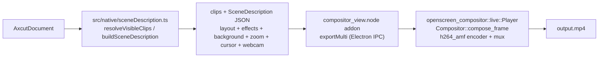

# Export pipeline

The MP4 export drives the same Rust + Direct3D 11 compositor that powers the
live preview ([preview.md](preview.md) /
[native-compositor.md](native-compositor.md)), one segment at a time. The
Electron renderer turns the project document into the same `SceneDescription`
the live preview uses plus an ordered clip list, hands both to the napi addon
through the `compositor` IPC domain, and the addon drives `openscreen-compositor`'s
`Player` + `Compositor::compose_frame` + AMF encoder + muxer to write one
`.mp4`. The renderer only watches progress; the actual rendering does not
leave the native process. Performance numbers, the bench, and the rejected
alternatives that drove the design live in
[engineering/rendering-performance.md](../engineering/rendering-performance.md).

GIF is out of scope here: it has no native encoder yet, so it keeps its own
dedicated code path in `src/lib/exporter/gifExporter.ts` — the one format
the document adapter still renders in the renderer.

## Segment loop

The renderer hands the addon `exportMulti(clips, outPath, sceneJson, params)`
through `compositorViewService.exportMulti`
([`compositorViewService.ts:425`](../../electron/native-bridge/services/compositorViewService.ts)).
The service resolves the same asset paths the renderer used (wallpaper
images, cursor theme sprite) and forwards the call to the addon
([`compositorViewService.ts:437`](../../electron/native-bridge/services/compositorViewService.ts)).
The addon loads `openscreen-compositor`'s `Player` with the clip list and the shared
`SceneDescription` JSON, then walks the segments with **one** compositor
and **one** encoder + muxer pair:

- Per segment: load metadata, hand the asset to the `Player` (so screen
  and webcam decode land on `openscreen-compositor`'s shared `ID3D11Device`), drive
  `compose_frame` at the segment's source time, and let the AMF encoder
  consume the rendered RT. The compositor is paused on the live preview
  for the duration of the export (`set_playing(false)` on every active
  preview view), which the addon does automatically — the only cost of
  running export against a live preview is GPU contention from the preview
  still composing; the bench measures that overhead at ~10 % of wall time
  in the measurement scenario, recovered by the auto-pause.

- **Time projection.** The encoder timestamp is contiguous **output**
  time, so junctions between segments are seamless. `compose_frame`
  receives **source** time (`source_t = frame / FPS`), so
  zoom / annotation / cursor match the frame's content even when a speed
  region retimes the segment. An earlier draft proposed keying effects in
  virtual time throughout; that does not survive speed regions, and the
  two-clock split is why.

- **Clips are contiguous** — no gaps, no overlap. The renderer sums
  per-segment rounded frame counts into a single output frame counter;
  audio follows the same integer accumulation (`AudioConcatPlan`).

- **Audio and video junctions are seamless.** Audio is decoded per clip
  (`audio.rs::decode_clip_audio`), a libavfilter `atempo` chain stretches
  each speed sub-segment to its output sample count, and
  `assemble_concatenated_pcm` concatenates the per-segment PCM at the
  integer sample offsets the video loop just produced — never
  `round(cumulativeSec * sampleRate)`, because that compounds per-segment
  rounding error into audible A/V drift across a long multi-segment
  timeline. A short equal-power fade (`cos` on the tail, `sin` on the
  head, `cos² + sin² = 1`) covers each internal boundary to suppress the
  click where two recordings meet butt-joined, without shifting timing.
  The in-tree WSOLA stretcher is still there, but only as the fallback
  `stretch_pcm_to_length` takes when the filter chain cannot be built,
  negotiates a format the drain does not read, or still comes up short of
  the target after the corrected pass (see
  [Audio](native-compositor.md#audio)).

- **The stretch runs beside the encode, not inside it.**
  `walk_composited_timeline`'s `on_clip_end` callback fires once per clip,
  after that clip's frames have been composed and submitted to the
  encoder. It used to decode and stretch that clip's audio right there,
  on the render thread; since a clip's audio depends on nothing but that
  clip, it now hands the work to `ClipAudioJobs`
  ([`audio_jobs.rs`](../../crates/compositor/src/audio_jobs.rs), at most
  four in flight) and the walk carries straight on to the next clip. The
  results are collected after the walk, indexed by clip. `spawn` admits
  four before it collects one, so what is left to wait for at the end is up
  to four jobs — bounded by the slowest of them, not by their sum. Dropping
  the collection joins them rather than detaching, so an export that fails
  between the walk and the collection does not leave decoders running.

  This matters for reporting as much as for wall time. `progress()`
  counts composed frames as they are handed to the encoder and nothing
  calls it during the audio phase, so while that work sat on the render
  thread the bar parked at whatever percentage the clip's last frame
  reported — for minutes, back when WSOLA was O(grain × radius) per
  rendered sample. That is the reporting half of "frozen at ~80%"; the
  cost half was the move to `atempo`.

- **The progress total is speed-adjusted.** The native side reports a raw
  running count of composed frames and never a total, so the percentage
  is computed in the renderer
  ([`outputFrameCount`](../../src/lib/exporter/outputFrameCount.ts)). It
  has to mirror `speed_segments_for_window`, because a clip under a 1.25×
  region emits `duration × fps / 1.25` frames: counting source seconds
  instead made the bar stop at exactly 80% and the export finish there —
  the number in the title of the bug. The two sides share one fixture
  table, asserted by `outputFrameCount.test.ts` and by
  `speed_segments_match_the_exporter_frame_totals`.

- **Imported audio tracks** (voiceover / BGM / SFX, issue #350) are mixed
  on top of the assembled programme by `audio.rs::mix_external_tracks`,
  between `assemble_concatenated_pcm` and `finish_audio`. Each track's
  trim window is decoded through the same `decode_clip_audio` path a clip
  uses, scaled by its per-track gain, and summed in at its `startSec`
  offset; a track running past the video is truncated to it so the two
  streams stay the same length. `startSec` is resolved renderer-side
  (`buildSceneDescription`) from the track's raw timeline position — an
  identity map without trims/speed, an accepted approximation otherwise,
  matching how the preview approximates trims by re-seeking. The CLI's
  `openscreen export --audio` remains a separate post-export remux
  (`voiceoverMix.ts`) for a single track and is unaffected.

- **Output** honours the timeline's selected aspect ratio
  (`resolveAspectRatioValue` over `getEditorSettings(document).aspectRatio` —
  the same typed façade `buildSceneDescription` reads, so the dialog cannot
  drift from the compositor). `ExportDialog`'s `tierOutputDims` feeds the
  crop-aware **smallest** clip on the timeline to
  [`calculateMp4ExportSettings`](../../src/lib/exporter/mp4ExportSettings.ts),
  which maps quality + source dims + aspect ratio to the encoder
  width / height / bitrate, and passes `width` / `height` to `exportMulti`.
  Only "Source" quality targets those source dims; 720p / 1080p target a
  fixed short side regardless.

## Output formats and codecs

The native MP4 export takes `width`, `height`, `frameRate`, and `codec` as
parameters on `exportMulti` and writes H.264 (AMF) by default. The
user-facing codec choice crosses as the plain `ExportVideoCodec` string
(`"h264"` / `"h265"` / `"vp9"`) in those params; VP9
falls back to the same H.264 path on machines without a hardware VP9
encoder (software VP9 was measured too slow and removed — see
[native-compositor.md](native-compositor.md#known-gaps)). GIF is a
separate path through `GifExporter` and does not use the native addon.

## Licensing

The app is MIT and stays MIT. Any bundled ffmpeg must be built **without**
`--enable-gpl` and without `--enable-nonfree` — those flags pull
x264/x265/xvid and fdk-aac, and licensing is all-or-nothing. The same
rule applies to the BtbN build the addon links against (see
[native-compositor.md](native-compositor.md#build)): LGPL-shared
`*lgpl-shared`, not GPL. `scripts/fetch-ffmpeg.mjs` vendors a pinned,
checksum-verified BtbN LGPL build and gates it on three independent
signals (`-L` says "Lesser General Public License"; no GPL flags or GPL
libs in `-buildconf`/`-version`; no `libx264` / `libx265` in
`-encoders`). It fails closed.

Note `ffmpeg -version` has **no** `License:` line — only `configuration:`.
The licence text is behind `-L`. An early gate looked for the former,
found nothing, and refused to vendor anything; failing closed is why that
was a bug and not an incident.

## Traps this pipeline has actually fallen into

Each cost hours and each produced a confident, wrong conclusion.

1. **`app.getGPUFeatureStatus()` from a windowless script** reports
   everything `disabled_software`. Always probe with a real window.
2. **Piping via `cat` under Git Bash** caps at ~70 MB/s — MSYS emulation,
   not Windows.
3. **`new VideoFrame(canvas)` is lazy.** Timing the constructor measures
   nothing.
4. **Isolated component benchmarks cannot price the cost of connecting
   the component.** A `node → ffmpeg` probe measured 489–589 MB/s by
   materialising frames **once**, outside the timed loop — a true
   statement about the pipe that said nothing about the pipeline.
5. **`-encoders` lists what was compiled in, not what the machine can
   run.** A portable build lists nvenc/qsv/amf everywhere; on this AMD
   laptop nvenc dies with "Cannot load nvcuda.dll". Only a one-frame
   smoke encode settles it — and the unit tests passed *because the
   fixtures encoded the same wrong assumption as the code*.
6. **Electron cannot transfer an `ArrayBuffer` renderer→main.** The
   transfer list takes `MessagePort[]`; transferring a buffer silently
   drops the whole message
   ([electron#34905](https://github.com/electron/electron/issues/34905)) —
   it works renderer→renderer.
7. **`Buffer.from(typedArray)` copies.** Wrapping
   (`Buffer.from(buf.buffer, byteOffset, byteLength)`) measured +31 %.
8. **A stale `dist-electron` bundle** runs the *previous* main process
   against the new renderer. It read as "export IPC not registered" once
   and as "the bench flag does nothing" once. The bench now refuses to
   run against one.
9. **A second instance of the same build quits silently.** The lock keys
   on the `userData` path, so another dev build already running makes a
   launch exit 0 and report nothing. The installed app
   (`openscreen.exe`) resolves a different `userData` path and does not
   conflict.
10. **`libopenh264` accepts a bitrate and does not control it**
    ([#572](https://github.com/getopenscreen/openscreen/issues/572)). Not a
    wiring mistake: ffmpeg *does* forward `bit_rate` into `iTargetBitrate`
    and `sSpatialLayers[0].iSpatialBitrate`, and it reads back correctly
    after `avcodec_open2`. The wrapper simply leaves `bEnableFrameSkip = 0`,
    and openh264 says so out loud at open time — *"bitrate can't be
    controlled for RC_QUALITY_MODE, RC_BITRATE_MODE and RC_TIMESTAMP_MODE
    without enabling skip frame"*. The only option that restores a real
    ceiling is `allow_skip_frames`, which pays for it in dropped frames (3
    of 120 survived on incompressible input), so it stays off. `rc_mode`,
    `rc_max_rate`, `rc_buffer_size`, `max_nal_size` and `level` were each
    measured and each do nothing. What the requested bitrate *is*, on this
    encoder, is a weak input to a complexity→QP model clamped to [12, 51]:
    an approximate ceiling on dense content, and nothing at all on a static
    screen, where it pins to QP 12 and spends the same 0.68 Mbps whether
    you ask for 8 or 40. Two knobs do work and are set in
    `VideoEncoder::tune_openh264` — see that doc comment before reaching
    for a third.
11. **A missing `gop_size` cost every Linux export its keyframes.** Most
    encoders inherit the generic `AVCodecContext` default of 12, so leaving
    the field unset is survivable; `libopenh264` overrides it to `-1` in its
    `FFCodecDefault` table, which openh264 reads as `uiIntraPeriod = 0` —
    *one* IDR for the whole file. Measured 1 I-frame in 300 before the fix.
    Nothing warns, nothing fails, and the MP4 plays fine: the damage is that
    every seek redecodes from frame 0 and one bad packet takes the rest of
    the video with it. Set `gop_size` explicitly rather than trusting any
    encoder's default.

## A truncated project file is unopenable, not partially readable

`listProjects` skips a project whose JSON does not parse, so a truncated file
presents as a project that has vanished rather than as an error. Worth knowing
when a bench fixture disappears.

Two concurrent saves used to be able to produce exactly that. They no longer can:
`DocumentService` serialises saves through a per-project write queue and writes
atomically (unique temp file → `fsync` → rename, `electron/ai-edition/document-service.ts:354`).
One fixture from before the fix is still corrupt — see the Known gaps in
[../engineering/rendering-performance.md](../engineering/rendering-performance.md).

The reason that one was never repaired is the useful part: its recoverable prefix
had `speedRegions: 0, zoomRegions: 0` while the real timeline held two 3× speed
regions and a 1.80× zoom. Truncating to the valid prefix would have returned a
project that opened cleanly and was silently stripped of its effects. **A partial
document that parses is more dangerous than one that does not** — which is why the
loader rejects rather than salvages.