# Transcription and captions

OpenScreen turns recorded audio into on-device text, and renders that text as
captions over both the preview and the export. The recogniser runs natively on
the desktop — no network calls, no Python — and feeds a single transcript per
asset into a caption layer that derives its cues on every render. Code lives
in `electron/stt/` (main-process STT pipeline), `electron/native/whisper-stt/`
(the C++ helper that links whisper.cpp directly), and
`src/lib/ai-edition/captions/` (the caption layer that derives its cues from
the transcript).

## Pipeline

```mermaid
flowchart LR
    Z["Asset added<br/>(import or recording)"] -- "sync()" --> Y["transcriptionStore queue<br/>(src/lib/ai-edition/store/transcriptionStore.ts)"]
    Y -- "one job at a time" --> A["Recorded audio"]
    A -- "extract mono 16 kHz" --> B["transcribeAsset<br/>(src/lib/ai-edition/document/transcribe.ts)"]
    B -- "IPC: Float32Array + language" --> C["SttManager<br/>(electron/stt/index.ts)"]
    C -- "POST /inference (WAV)" --> D["whisper-stt-server<br/>(electron/native/whisper-stt/)"]
    D -- "VAD cut + whisper_full() + DTW" --> E["SttTranscribeResponse<br/>(segments + wordSegments)"]
    E --> C
    C -- "IPC return" --> B
    B --> F["AxcutTranscript<br/>on document.transcripts[]"]
    F --> G["deriveCaptionCues<br/>(src/lib/ai-edition/captions/cues.ts)"]
    G -- "CaptionCue[]<br/>(virtual ms)" --> H["captionCuesToTextRegions<br/>(synthetic text regions)"]
    H -- "annotation path<br/>(scene description)" --> I["Native compositor<br/>(preview AND export)"]
```



The renderer pieces — `transcribeMono16kToSegments`
(`src/lib/captioning/transcribe.ts`) called from `transcribeAsset`
(`src/lib/ai-edition/document/transcribe.ts`) — are a thin IPC adapter: the
audio crosses to the main process, the helper does the recognition, and the
result is mapped back onto the `AxcutTranscript` shape the rest of the editor
reads. From the moment that transcript is persisted, captions and the words
they show cannot drift — captions are a derived view, not a parallel store.

## Auto-transcription

Recognition is local and free, so the editor does not wait to be asked: every
asset in the document gets a transcript on its own. The queue lives in
[`src/lib/ai-edition/store/transcriptionStore.ts`](../../src/lib/ai-edition/store/transcriptionStore.ts),
mounted once by the shell through `useAutoTranscription()`, and it is the only
thing that calls `transcribeAsset`.

Why it exists at all: "Smart cuts with AI" (and captions, and the transcript
pane) need a transcript, but nothing produced one until the user found the
Media tab or the transcript pane and pressed a button. The obvious first click
was therefore also the one that could not work. Now the button is either ready,
or it says what it is waiting for.

What the store owns and what it does not:

- **The document owns the transcript.** `document.transcripts[]` is still the
  source of truth for "is there one"; the store only owns the JOB (queued /
  running / failed + the phase for the spinner). `deriveAssetStatus`
  ([`transcription/status.ts`](../../src/lib/ai-edition/transcription/status.ts))
  folds the two into the single status the UI renders, and
  `resolveTranscriptGate` folds a set of those into the ready / pending /
  blocked verdict that enables or disables a transcript-dependent action.
  A stored transcript **outranks a failed job**: a regenerate that dies on a
  whisper restart leaves the previous transcript in place and usable, and
  reading that asset as "failed" would have disabled Smart cuts for the rest of
  the session over a transcript sitting right there.
- **Gates are resolved over the assets the TIMELINE plays**
  (`transcriptRelevantAssetIds`), never over `project.primaryAssetId`. In a
  recording project the primary asset is the screen capture — frequently the
  silent one — so a primary-scoped answer had the transcript and captions panes
  announce "this media has no audio track" for a project whose actual footage
  was mid-transcription. `requestTimelineTranscripts` is the matching action for
  the panes' one button: every timeline asset that still lacks a transcript,
  skipping the ones already known to be silent and waiting on (rather than
  duplicating) a run the background pass already has in flight.
- **One run at a time.** whisper-server is a single process and the audio
  extraction path holds decoded frames in renderer memory, so the pump is a
  sequential loop, not a fan-out.
- **The auto pass never loops.** `sync` enqueues an asset only when it has no
  transcript, no job entry (queued / running / failed alike) and no persisted
  failure, and a job is deleted only after the save that carries its transcript
  has resolved. Since `sync` runs on every document change — including the one
  the run itself produces — that guard is what keeps it from re-triggering.
- **Silence is remembered, glitches are not.** A media with no audio track (a
  screen recording captured with no mic and no system audio) fails the same way
  every time, so the verdict is written to `asset.transcriptionFailure` and the
  auto pass skips it on the next load instead of re-extracting its audio to
  rediscover it. Everything else stays in memory for the session and is retried
  on the next load. A successful manual retry clears the stored verdict in the
  same save that writes the transcript. The verdict is read off the exception
  MESSAGE (`classifyTranscriptionError`), because `ipcRenderer.invoke` rebuilds a
  plain `Error` and drops the class — so a new decoder phrasing has to be added
  there or its silence gets filed as a generic failure, which is issue #628.
- **No local engine, no background pass.** Without `window.electronAPI.stt`
  (browser preview, e2e shim) nothing is queued; a manual request still runs.

What each state means in the UI: a spinner and "Transcribing…" while queued or
running, the media-card dot green (ready) / amber (silent or no speech) / red
(failed) via
[`TranscriptionStatus.tsx`](../../src/components/ai-edition/TranscriptionStatus.tsx),
and — the point of the whole thing — a disabled "Smart cuts" entry whose
subtitle is the reason rather than "With AI".

### One phase, including the first-run model download

On a fresh install the GGML model (~264 MB) is not on disk. It is fetched by
`SttManager.prepare()` **inside** the `stt:transcribe` IPC call — i.e. inside a
run this store has already marked `running` — so the user sees one single busy
phase that simply takes longer the first time. That is deliberate: no separate
"downloading" step, no progress bar to stare at, and nothing that looks
clickable in the meantime (`phase: "model"` is emitted by the main process but
deliberately not forwarded to the renderer by `transcribeAsset`). Nothing in the
renderer imposes a timeout that a slow download could trip: the preload does a
bare `ipcRenderer.invoke`, `fetchWithRetry` has no per-request deadline, and
whisper-server's 30 s readiness budget only starts once the download resolved.

The word aligner (§ Word-level alignment, step 5) is not part of that phase: it
is fetched in the background the first time a transcription on a GPU detects English or
French (109 or 348 MB), and no chunk ever waits for it.

Three edges make that promise hold, and each is load-bearing:

- **A failed setup is not cached.** `SttManager.init` used to memoise the
  rejected `prepare()` promise, so one dropped connection during the first
  download failed every later transcription in the session — including the retry
  the editor offers — until the app was restarted. It now clears the slot on
  failure ([`electron/stt/index.ts`](../../electron/stt/index.ts)).
- **A transient failure stops the queue** instead of walking the remaining
  assets into the same wall: they inherit the verdict (one toast, one retry
  affordance) rather than each spending a full retry budget.
- **Read-only is scoped per asset.** The transcript pane's blocks go read-only
  only for the asset whose transcript is being rewritten, and say so (spinner +
  "Transcribing…" + dimmed stream). A timeline-wide flag made every other
  clip's word stream swallow Backspace and hover-bin clicks in silence for the
  whole background pass.

Still synchronous, and still on the main thread: `mixToMono`
([`src/lib/captioning/extractMono16k.ts`](../../src/lib/captioning/extractMono16k.ts))
now hoists its channel arrays out of the sample loop (it was making one WebIDL
call per sample per channel), but a long recording will still block the renderer
for a moment during "extracting-audio". Moving the mixdown to a worker is the
next step if it shows up in practice.

## The STT engine

The recogniser is **whisper.cpp**, embedded as a static library inside one
helper executable per desktop platform. whisper.cpp picks the actual compute
backend at runtime — Metal on Apple Silicon, Vulkan on Windows and Linux, CPU
fallback when no usable GPU or driver is present — so the renderer only knows
which backend the helper bound by reading the response field at
[`electron/stt/transcriptionContract.ts:35`](../../electron/stt/transcriptionContract.ts:35).
There is no OS-side GPU probing; `electron/stt/gpuDetector.ts` resolves the
per-platform binary name only, and the real backend is corrected from the
helper's `/inference` JSON.

Why whisper.cpp, in one paragraph: a single C++ dependency with native DTW
token timestamps for word-level timing and portable runtime device selection
that covers Metal, Vulkan and CPU in one binary. `whisper_full()` does its own
long-form windowing over anything longer than 30 s, so no manual windowing is
required on our side — OpenScreen chunks anyway, for progress and retry
boundaries rather than for correctness (see § Long-form recordings). Validation
data — backend-by-backend WER and real-time factors — lives in
[`tools/stt-eval/whispercpp-dtw-poc/REPORT.md`](../../tools/stt-eval/whispercpp-dtw-poc/REPORT.md).

### Per-platform backend

The binary is named `whisper-stt-server` (`.exe` on Windows) on **every**
platform — the backend is a build-time flag, not a file name, and
`binaryNameForBackend`
([`electron/stt/gpuDetector.ts:60`](../../electron/stt/gpuDetector.ts:60))
returns that single name. What varies is which backend was compiled in:

| Platform | Backend compiled in | Runtime device candidates |
|---|---|---|
| macOS arm64 | Metal (`-DOSC_ENABLE_METAL=ON`) | Metal, CPU |
| macOS x64 | CPU only | CPU |
| Windows x64 | Vulkan (`-DOSC_ENABLE_VULKAN=ON`) | Vulkan, CPU |
| Linux x64 | Vulkan (`-DOSC_ENABLE_VULKAN=ON`) | Vulkan, CPU |

whisper.cpp chooses the device in `whisper_backend_init`; the helper reports
what actually bound (via `ggml_backend_dev_name()`) and `SttManager` returns
it verbatim in the response.

> `ggml_backend_dev_name()` returns a *device* name carrying an index —
> `Vulkan0`, `CUDA0`, `MTL0` — not the backend's title. Metal is the trap:
> ggml-metal builds its device name from `GGML_METAL_NAME` (`"MTL"`), so the
> string `"Metal"` appears nowhere in it. `detect_active_backend()` matched
> `"Metal"` and therefore reported `whispercpp-cpu` on every Apple Silicon run
> while the Metal backend was in fact bound. It now matches `MTL` and filters on
> `ggml_backend_dev_type()` being GPU/IGPU, which also drops ggml-blas
> (Accelerate on macOS, device type ACCEL) from consideration.

### Word-level alignment (DTW token timestamps, then a CTC aligner)

0. **Speech only** — when the Silero VAD model is on disk (`ggml-silero-v6.2.0.bin`,
   downloaded next to the whisper model), the helper cuts the silence out of
   the upload before whisper sees it, the way whisper.cpp's own VAD does: each
   speech stretch plus 0.1 s of tail, 0.1 s of silence between stretches. It
   keeps the map, and every time below goes back through it onto the upload's
   clock. The stretches are returned as `speech` for steps 5 and 6.
   > **Not whisper_full's `vad` param.** whisper.cpp 1.9.1 maps its *segment*
   > times back onto the original audio but not its token times, `t_dtw`
   > included, so every word came back early by all the silence removed before
   > it: 13 s into a 25 s clip. That shipped in 2.0.0-rc.1, and the harness
   > missed it (times were monotonic and inside the clip, just wrong); it now
   > checks that every word starts inside a stretch of speech.
   >
   > **The VAD runs on the CPU, always.** Asked for the GPU on Vulkan, 1.9.1
   > puts the VAD weights in a Vulkan buffer, finds no GPU for the VAD's own
   > backend and aborts in ggml (`0xC0000409`), so `SttManager` relaunched the
   > helper with `--cpu` and every transcription lost its GPU.
1. **Decode** — `whisper_full()` runs with the default sampling parameters
   (`WHISPER_SAMPLING_GREEDY`), returning phrase segments plus a per-token
   array.
2. **DTW timestamp** — every non-special token carries `t_dtw` in
   centiseconds from whisper.cpp's native DTW
   (`dtw_token_timestamps=true`, `dtw_aheads_preset=WHISPER_AHEADS_SMALL`,
   `flash_attn=false`, which together are the prerequisites for DTW to
   actually run). `t_dtw == -1` is the DTW-inactive guardrail: the helper
   fails the request rather than emit zero-quality timestamps.
   **The DTW pass is ours, not upstream's.** whisper.cpp teacher-forces the
   decoded BPE tokens a second time and aligns their cross-attention on the
   audio. [`whisper-patches/char-dtw.cpp`](../../electron/native/whisper-stt/whisper-patches/char-dtw.cpp)
   replaces that pass and feeds the text back **one character per decoder
   row** instead ("Whisper Has an Internal Word Aligner", arXiv 2509.09987),
   so a boundary falls on the row of the space or letter where the next word
   starts, not on the edge of a multi-letter token. `CMakeLists.txt` splices it
   into a build-tree copy of `whisper.cpp`; the fetched source is never edited,
   and bumping `WHISPER_REF` fails the configure if the code it replaces moved.
   What it does differently, each measured on the harness below:
   - the heads' attention is averaged and each audio frame scaled to unit L2
     norm, as in the paper. Upstream's z-score and median filter do worse on
     characters, and the median filter was most of the pass's CPU time;
   - French drops one silent final consonant per word (*vais*, *vous*,
     *plaît*) before aligning. Its row otherwise holds the start of the next
     word: +60 to +140 ms on the word after it;
   - the decoder has 448 positions. A window too long as characters is
     aligned in several passes, each with one stretch as characters and the
     rest of the window as BPE tokens;
   - the alignment heads stay `WHISPER_AHEADS_SMALL`. Picking the ten heads
     with the most concentrated attention per window out of all 144, as the
     paper does, chose nearly the same ten every time and scored worse
     (inner median 24 ms, phrase starts 82% within 50 ms).
3. **Word grouping** — BPE tokens join into a single word whenever the
   detokenized text begins with a space, or at the first token of the
   segment.
4. **Word range** — a token's `t_dtw` marks where it **ends**, not where it
   starts. In `whisper_exp_compute_token_level_timestamps_dtw` (whisper.cpp
   1.9.1) the alignment rows start at `<|notimestamps|>`, whose output is text
   token 0, and `t_dtw[k]` is written when the DTW path enters row *k+1*: the
   row that predicts token *k+1*. So:
   - `word.start` = `t_dtw` of the text token **before** the word's first
     token. The previous token carries across segments; the request's very
     first word has none and falls back to its own first token.
   - `word.end` = `t_dtw` of the word's **last** token.
   - `word.anchor` = `t_dtw` of the word's first token. It always lies inside
     the word, and only decides which stretch of speech owns it (steps 5 and 6).

   The result is a monotonic, gap-free timeline of word ranges on the upload's
   clock. Taking the first token's `t_dtw` as the start, as the helper did
   before, put every word one token late: +175 ms median on the TTS corpus
   below, and a median 200 ms on a real French take. The repo's DTW POC saw
   the same thing as whisper.cpp's `t_dtw` matching faster-whisper's word
   **end** (`tools/stt-eval/whispercpp-dtw-poc/REPORT.md`).
5. **Re-time the words on a CTC aligner** (issue #948, phase 3) — when the
   chunk ran on a GPU and the language whisper detected has an aligner, a wav2vec2 model fine-tuned for CTC scores
   every 20 ms frame of the speech against every letter, and
   [`electron/stt/ctcAlign.ts`](../../electron/stt/ctcAlign.ts) forces
   whisper's own words through those scores:
   - **The helper only scores.** `POST /emissions` (same WAV, the aligner's
     GGUF path, the regions to score: each stretch of speech ±0.3 s, merged)
     answers the log-probabilities per frame
     ([`ctc_aligner.cpp`](../../electron/native/whisper-stt/src/ctc_aligner.cpp),
     a wav2vec2 forward pass on ggml, on the GPU whisper uses). It is a
     separate request so the stage stays separate: it reads whisper's words,
     whatever produced their times.
   - **Spelling.** Each word is lowercased (uppercased for the English model),
     its apostrophes normalised, its punctuation dropped, and an accent the
     vocabulary lacks falls back to the base letter. A word that cannot be
     spelled (digits, `€`, another script) becomes one wildcard token that
     scores as the frame's best letter, so it holds its place and its
     neighbours stay aligned. The vocabulary's word delimiter `|` goes between
     words.
   - **Viterbi** over the frames of each stretch (the one that owns the words
     by `anchor`, as in step 6), then calibration: CTC is sure of a letter a
     little after the sound starts and before it ends, so a word starts 45 ms
     before its first letter's frame and ends 25 ms after its last one. Where
     the two estimates cross inside continuous speech, the boundary is their
     midpoint. Next to a pause (a gap of 100 ms or more between letters) the
     edges move further out, 60 ms before and 150 ms after, both capped at
     mid-pause: early there is silence, late is an audible attack.
   - **GPU only.** On the CPU the forward pass would add 29% (English) to 58%
     (French) to a transcription, against 9 to 14% on Vulkan, for a gain over
     step 2's character-level DTW that is not worth that there. A chunk whisper
     ran on the CPU skips this step, and a CPU-only machine never downloads the
     model.
   - **Fallback.** CPU, no aligner for the language, a download not landed yet or
     failed, a helper without `/emissions`, a stretch whose letters do not fit in
     its frames: the words keep the times of step 4. Step 6 runs either way.
6. **Anchor phrase edges on the speech** —
   [`electron/stt/snapWordBoundaries.ts`](../../electron/stt/snapWordBoundaries.ts)
   leaves boundaries inside a phrase alone: they are within ~15 ms of the audio
   already, and an energy snap on top of them drags correct boundaries early.
   The edges of a phrase are different. The token before a phrase's first word
   is the previous phrase's last one, so that word starts in the pause, as
   early as the previous phrase's end; a word that opens a decode window starts
   late on its own first token. Its last word ends on the last token DTW
   aligned, short of the speech or past it into the pause. With `speech`:
   - the first real word of each stretch starts on the stretch's onset, pulled
     back when it is late and clamped forward when it is early;
   - its last real word ends on the offset, and the punctuation closing the
     phrase collapses to a point there;
   - a stretch owns the words whose `anchor` falls in it or in the 0.1 s tail
     the helper keeps past its offset (`ownWords`, which step 5 reads too);
   - except a word that ends a sentence (`.`, `!`, `?`, `…`, full-width forms
     included) anchored in the pause, before the next stretch's speech: it
     closes the stretch before it, with its punctuation. DTW put "happened."
     of "…as if nothing happened. The transcript…" there on an rc.6 take, so
     the next stretch put it on its onset, after "The", as a 20 ms word, and
     the aligner looked for it in "The"'s audio (issue #948). A one-word
     sentence anchored inside the next speech ("Heaven!") still opens it;
     moving those too cost phrase deletes on LibriSpeech;
   - last, starts are made monotonic and no word ends before it starts: a
     start past the next word's comes back to it.

   Words own the speech, never the pause: deleting a phrase's last word keeps
   the pause after it. `MAX_ANCHOR_SEC` bounds the stretching only: a word more
   than 1 s past an edge is more likely the neighbour of one whisper dropped,
   and is left alone.

> Why this matters beyond caption timing: the transcript editor turns a word
> selection into a trim of exactly `[firstWord.startSec, lastWord.endSec]`,
> so a late boundary leaves the attack of the first removed word audible and
> an early one bites into the kept word next to it.

**Measuring it** — [`tools/stt-eval/word-timing/`](../../tools/stt-eval/word-timing/README.md)
scores the helper and this post-pass against a Windows-TTS corpus with exact
word times (27 min of French and English narration, clean and noisy):
boundary error by position, and the audible residue and clipping of deleting
one word or one phrase. Issue #948 has the method, the baseline and the plan.
The same harness scores real read speech: 46 min of LibriSpeech test-clean
(40 speakers, English) against Montreal Forced Aligner word times, which are
themselves about 10 to 20 ms from a human's.

| Pipeline | Inner start: median / P90 / within 50 ms | Phrase-initial start within 50 ms | One-word delete: clean cuts | Phrase delete: clean |
|---|---|---|---|---|
| First-token start + 150 ms RMS snap + VAD edges (before #948), TTS | 105 / 275 ms / 32% | 83% | 5% | 84% |
| Previous-token start + two-way VAD edges (phase 1), TTS | 31 / 125 ms / 64% | 89% | 19% | 88% |
| Same, character-level DTW (phase 2), TTS clean | 17 / 60 ms / 86% | 89% | 39% | 94% |
| + CTC aligner (phase 3), TTS clean | 14 / 35 ms / 96% | 95% | 50% | 95% |
| Phase 2, TTS noisy | 16 / 60 ms / 86% | 88% | 40% | 92% |
| + CTC aligner, TTS noisy | 15 / 39 ms / 95% | 94% | 48% | 93% |
| Phase 2, LibriSpeech | 20 / 65 ms / 82% | 63% | 35% | 81% |
| + CTC aligner, LibriSpeech | 15 / 45 ms / 92% | 73% | 44% | 82% |

Per language, character-level DTW gives French 19 ms median and 83% within
50 ms (was 26 ms, 70%) and English 15 ms and 89% (was 40 ms, 57%). The aligner
takes French to 14 ms and 95% (P90 66 → 36 ms, clean cuts 33% → 47%) and
English to 15 ms and 96% (P90 50 → 35 ms, clean cuts 45% → 52%). Deleting one
word then leaves 17 ms of it audible and cuts 15 ms into its neighbours (TTS
clean; 20 and 12 ms on LibriSpeech), against 19 and 24 ms with phase 2 alone.
The misses left on phrase-initial starts are mostly the reference's: the French
TTS voices start a word on its silent stop closure, which no aligner hears.

On a real French take (25 s, no reference), every boundary the aligner moved
by 40 ms or more was checked against the audio's energy and zero crossings at
10 ms: each now sits on the acoustic boundary. "c'est" starts on its /s/
(phase 2 was 90 ms early, in the end of the word before); "quoi" starts where
the /k/ closure begins, after the vowel of *c'est* (phase 2 was on the burst,
70 to 80 ms later, which is also a clean cut since the closure is silent);
in "en fait on va" the aligner is on the /f/, the dip before *on* and the /v/,
where phase 2 was 30 to 50 ms off each.

Dropping French silent final consonants before aligning, as step 2 does, was
tried and left out: it changed none of the take's boundaries by more than
15 ms, and on the corpus it traded 3 points of French clean cuts for 1 to 2
points of French phrase deletes (a phrase-final *fois* and *Windows* lost the
letter that held their end).

A +15 ms calibration offset on every boundary gained 4 points of inner
boundaries within 50 ms but dropped noisy phrase deletes to 82%, so it is not
applied.

Snapping a cut between two words said without a pause (a gap under 100 ms) to
the quietest point near their boundary, leaving the word times alone, was
measured for issue #1023 and left out. The reference is what the transcript
pane already does: a cut next to kept speech breathes up to the middle of a
short gap (`src/lib/ai-edition/timeline/cut-breath.ts`), which on the corpus
with the aligner gives 51% clean one-word deletes and 95% clean phrase deletes
(49% and 94% with the cut on the word times). Against that:

- moving the cut to the lowest-energy 10 ms within ±10, 20 or 30 ms gives 48%,
  41% and 33% clean one-word deletes. Inside continuous speech a fricative or
  a stop closure next to the boundary is quieter than the boundary itself, so
  the minimum lands inside a word;
- moving it only onto near-silence (30 dB under the boundary) touches 48 of
  6,509 boundaries at ±20 ms and changes no figure.

The old RMS snap failed the same way (step 6 above).

The recognition call returns **both** the phrase segments and the per-word
segments in one pass
([`electron/stt/transcriptionContract.ts:17-30`](../../electron/stt/transcriptionContract.ts:17)),
so no second pass is needed.

### Long-form recordings

`whisper_full()` handles recordings longer than 30 s internally, but OpenScreen
splits them first anyway: `chunking.ts` cuts at the quietest frame near each
90 s boundary, the chunks are transcribed sequentially, and their absolute
timestamps are restored afterwards. That is not for correctness — whisper's own
windowing would cope — but so progress stays observable and a failed chunk can
be retried without re-running the whole recording. The validation set exercises
130 s at WER 0.076 with full per-word coverage (see the validation report
linked above).

### Model

The recogniser is `ggml-small-q8_0.bin` from
`ggerganov/whisper.cpp` on HuggingFace: Whisper `small`, multilingual (~99
languages), q8_0 quantised, ~264 MB. Beside it, the same code path fetches
Silero VAD v6.2.0 (`ggml-org/whisper-vad`, 0.9 MB) for step 0 of the
alignment. Precision is baked into the GGML file —
there is no runtime `--int8` flag. `electron/stt/modelManager.ts` downloads
the file once into the user-data cache and writes it through an atomic
`.partial` rename, so a half-downloaded file can never be picked up as a
usable model. The SHA-256 is checked on the cached copy too, not only on a
fresh download, so a model corrupted after the fact is re-fetched rather than
handed to whisper.cpp. A cached copy that fails the check is left alone until
a verified replacement has landed — the atomic rename displaces it — so a
failed re-download never leaves a user with no model at all.

The download URL resolves through an immutable commit revision rather than
`resolve/main`. Because the cache is now verified on every start, a re-upload
under the mutable branch pointer would invalidate every installed cache at
once instead of merely breaking new installs; pinning makes the recorded
digest an invariant. Bumping the model therefore means bumping the revision
and the digest together.

**The word aligners** (step 5) are fetched only for a language that has one,
into `stt-models/ctc-aligner/`, and never inside a chunk. The first time a
session meets a language, a copy already on disk is verified in place (a local
read). Without one, the download starts in the background
(`SttManager.alignerFor`): the chunks that run before it lands keep whisper's
times, the later ones and later transcriptions use it. A download stalled for
30 s, cancelled with the transcription, or interrupted by quitting is
abandoned, and retried on the next transcription rather than per chunk.

| Language | Model | Download |
|---|---|---|
| English | `facebook/wav2vec2-base-960h` (12 layers, letters) | 109 MB |
| French | `jonatasgrosman/wav2vec2-large-xlsr-53-french` (24 layers, letters and accents) | 348 MB |

Both are Apache-2.0. `scripts/convert-wav2vec2-gguf.mjs` turns the upstream
`model.safetensors` into the GGUF the helper loads: linear weights Q8_0 (which
is what keeps the French model under 350 MB), convolutions F16, the positional
convolution's weight norm folded. The conversion is deterministic, so the
SHA-256 pinned in `CTC_ALIGNERS` (`electron/stt/modelManager.ts`) can be
reproduced from the upstream revision it names. The files are served from a
`v0.0.0-ctc-aligners-1` release, the convention this repo uses for binaries
that need a permanent URL but are not a product version.

> The HuggingFace identifier is intentionally `ggerganov/whisper.cpp`,
> **not** `ggml-org/whisper.cpp`. The latter matches the GitHub org the
> engine itself now lives under, but on HuggingFace it is a separate,
> access-gated repo that returns 401 on every file (including its README).
> whisper.cpp's own `models/download-ggml-model.sh` pulls from
> `ggerganov/whisper.cpp`, which is what the helper consumes.

### Modules

| Module | Role |
|---|---|
| `electron/stt/whisperServer.ts` | Server lifecycle; `POST /inference` client; verbose_json parser. |
| `electron/stt/ctcAlign.ts` | Re-times words on the CTC aligner's letter scores (step 5): spelling, Viterbi, calibration, fallback. |
| `electron/stt/snapWordBoundaries.ts` | Anchors phrase edges on the VAD's speech (see step 6 above). |
| `electron/stt/wav.ts` | WAV write + temp-file cleanup helpers. |
| `electron/stt/gpuDetector.ts` | Per-platform binary resolver (no GPU probing). |
| `electron/stt/modelManager.ts` | Model downloads (whisper, Silero VAD, the per-language aligners), SHA-256 verify, atomic write. |
| `electron/stt/transcriptionContract.ts` | Shared IPC types (`SttBackend`, `SttWordSegment`, `SttPhraseSegment`, `SttStatusEvent`). |
| `electron/stt/index.ts` | `SttManager` — IPC entry point; wires the pieces together. |
| `electron/native/whisper-stt/src/main.cpp` | httplib HTTP server; cuts the silence out with Silero VAD and maps times back (step 0); calls `whisper_full()` with DTW; reports the device it bound via `ggml_backend_dev_name()`; `POST /emissions` for the aligner. |
| `electron/native/whisper-stt/src/ctc_aligner.cpp` | wav2vec2-for-CTC forward pass on ggml (base and large layouts), in 20 s windows; loads the GGUF written by `scripts/convert-wav2vec2-gguf.mjs`. |
| `electron/native/whisper-stt/CMakeLists.txt` | Pulls whisper.cpp via FetchContent; enables Metal (macOS arm64), Vulkan (Windows/Linux x64), CPU fallback everywhere; static backend linking into `whisper.dll`/`ggml.dll`. |

The helper is one executable per platform; backends are baked in at build
time and selected by whisper.cpp at load time.

### Build and run (dev)

```bash
# All platforms — build the helper (installs platform SDK deps first if needed)
bash scripts/build-whisper-stt.sh

# Windows (local MSVC + Vulkan SDK already installed)
# The script uses a short build path (C:/wstbuild by default) to avoid MAX_PATH
# issues inside whisper.cpp's vulkan-shaders-gen sub-project.

# Run the helper directly for manual testing
set OPENSCREEN_WHISPER_MODEL=%APPDATA%\Electron\stt-models\whisper-ggml\ggml-small-q8_0.bin
electron\native\bin\win32-x64\whisper-stt-server.exe --port 20199 --threads 8

# Test
curl -X POST -F "file=@test.wav" -F "language=auto" -F "response_format=verbose_json" \
  http://127.0.0.1:20199/inference
```

The helper's stderr logs the actual backend it bound
(`whispercpp-vulkan` / `-metal` / `-cpu`).

`npm run test:whisper-stt` round-trips a real clip through a real helper and
checks the response against the invariants below — segments and per-word
timings present, the DTW guardrail passed, `backend` reporting GPU offload on a
GPU-capable host, `detected_language` resolved rather than echoed, word times
monotonic and inside the clip, and WER against a reference. On macOS it
synthesizes its own clip with `say`, so it needs no fixture; elsewhere pass
`--wav <file>` (and optionally `--ref "<expected text>"`). When the detected
language's aligner is cached (or `OPENSCREEN_ALIGNER_MODEL` names one), it also
calls `/emissions` and checks that the answer is well-formed log-probabilities,
computed on the GPU on a GPU-capable host, decoding to roughly what whisper
heard (letter error rate), with the aligned words still ordered. This is the check
that the unit tests structurally cannot make: they mock `fetch`, so they assert
against a hand-written fixture rather than the binary.

#### What the staged directory has to contain

`electron/native/bin/<os>-<arch>/` is not just the executable. whisper.cpp is
built as **shared** libraries, so the helper is dynamically linked against
`whisper` plus the ggml backends, and every one of them has to sit next to the
binary:

- **Windows** — `whisper.dll`, `ggml.dll`, `ggml-base.dll`, `ggml-cpu.dll`,
  `ggml-vulkan.dll`.
- **macOS** — `libwhisper.*.dylib`, `libggml{,-base,-cpu,-blas,-metal}.*.dylib`,
  plus the version symlink farm (`libggml.dylib` → `libggml.0.dylib` →
  `libggml.0.15.1.dylib`).
- **Linux** — the `.so` equivalents, including the `.so.<major>` and
  `.so.<full>` links.

Two macOS/Linux-specific hazards, both of which shipped silently:

1. **The sidecar glob.** CMake emits `ggml-base.dll` on Windows but
   `libggml-base.dylib` / `libggml-base.so.0` elsewhere. A glob written as
   `ggml*.*` matches only the Windows spelling, so the staging step copied
   nothing but `libwhisper` on macOS and Linux and the helper died in dyld
   before `main()`. `build_variant()` now globs the `lib`-prefixed and
   `.so.<N>`-suffixed forms too, uses `cp -a` to keep the symlink farm intact
   instead of dereferencing each link into a full copy, and **fails the build**
   when it stages zero libraries.
2. **Absolute rpaths.** CMake bakes an `LC_RPATH` pointing at its own build
   tree, which resolves on the machine that built it and nowhere else — delete
   `.cache/`, or download the CI artifact onto a different runner, and the
   helper aborts (SIGABRT, exit 134) in the loader.
   `relocate_macos_rpaths()` strips every absolute `LC_RPATH` from the
   executable and each dylib, adds `@loader_path`, and re-signs ad-hoc
   (editing a Mach-O header invalidates its signature, and arm64 refuses to
   execute a modified unsigned image).

`scripts/stage-whisper-stt.sh` gates the installer on actually loading the
binary with a scrubbed `PATH`. That gate was written for Windows, where the
loader dies mute, so it asserted only that the process *printed something* —
and dyld and `ld.so` are chatty, so a macOS helper missing every ggml dylib
printed a four-line loader error and passed. It now requires the
`[whisper-stt] boot:` line that `main()` itself emits, which proves execution
rather than noise, and it no longer depends on `timeout` (GNU coreutils, absent
from a stock macOS runner — unqualified, `env: timeout: No such file or
directory` was itself enough "output" to satisfy the old check without ever
starting the binary).

## The transcription contract

The wire types in `electron/stt/transcriptionContract.ts` are shared across
the renderer, the main process and the tests, and every consumer of the
recogniser has to honour one invariant:

> **All `startSec` / `endSec` numbers in the contract — both at the IPC
> boundary and on `AxcutTranscript.words[]` in the document — are absolute
> seconds in the source recording**, `[0, audio.duration)` with
> `[startSec, endSec)` semantics.
> ([`electron/stt/transcriptionContract.ts:13-23`](../../electron/stt/transcriptionContract.ts:13))

Transcripts are stored per asset; the cue-projection step in
`src/lib/ai-edition/captions/cues.ts` handles the asset-to-timeline rebase.

The full response carries both shapes from a single inference pass:

```ts
export interface SttTranscribeResponse {
  segments: SttPhraseSegment[];
  wordSegments: SttWordSegment[];
  detectedLanguage: string;
  backend: SttBackend; // "whispercpp-metal" | "whispercpp-vulkan"
                       // | "whispercpp-cuda" | "whispercpp-cpu"
  timing?: SttTiming;  // { elapsedSec, audioSec, rtf }, summed over the chunks
}
```

`backend` is the device whisper.cpp actually bound at runtime — not the
platform default `gpuDetector` would have guessed — and `timing` is the
helper's own measurement around `whisper_full`, summed over every chunk of
the request. `rtf` keeps whisper.cpp's convention (wall-clock ÷ audio, so
lower is faster); the "× real-time" figure the UI shows is its reciprocal,
via `realtimeSpeed()` in `src/lib/ai-edition/transcription/status.ts`. It is
optional because a staged helper binary can pre-date the field — absent, not
zeroed, so "not reported" never renders as a measurement.

For anything user-facing, though, read them off the STATUS events rather than
this response: the response lands only once the whole recording is done,
which is far too late to explain a wait that is already happening.

The request takes a raw `Float32Array` of mono 16 kHz PCM and an optional
ISO 639-1 `language` code; `"auto"` or absent leaves detection to Whisper.
Status events fan out on a separate channel
(`SttStatusEvent`, `phase: "model" | "transcribe"`) so the renderer can
drive a "downloading model" / "transcribing" indicator without holding open
the inference request. Every landed chunk also carries `backend` and a
running `rtf` (cumulative for the run, not for that one chunk — a per-chunk
figure swings with how much speech a chunk holds and reads as noise), which
is what lets the media surfaces render "Transcribing 45% · CPU · 0.9×" while
the work is still going.

`SttManager` logs the same pair per chunk through `console.*` — the channel
the main-process ring buffer wraps, so the lines reach "Save Diagnostics",
which the helper's own stderr does not — and warns once per run when the
backend is `whispercpp-cpu`. That warning exists because the CPU path costs
roughly half the throughput (median 2.07×, see the POC report) and is only
ever reached through fallbacks that are otherwise completely silent.

## Captions

Captions are **a rendering of the transcript, not a parallel edit surface**.
The transcript is the single source of truth for spoken words and their
times; the caption layer decides only how those words appear on screen — how
many per line, where, in what font, in what language. Change any of those
three (transcript, caption settings, or the clips on the timeline) and the
cues follow on the next render, with no regeneration step and no stale copy
to reconcile
([`src/lib/ai-edition/captions/cues.ts:1-15`](../../src/lib/ai-edition/captions/cues.ts:1)).
The Captions pane never mutates `document.transcripts`; it only updates
caption settings and the optional translation side table.
The transcript backing the layer is documented at
[document-model.md](document-model.md) (`transcripts[]`).

### How cues are built

1. **Stream** — for one asset, `captionLinesForAsset`
   ([`src/lib/ai-edition/captions/cues.ts:89`](../../src/lib/ai-edition/captions/cues.ts:89))
   produces a stream of timed single-word entries. Two flavours, decided by
   `settings.language`:
   - **Original** (`language === null`): one entry per
     `transcript.words[]` with the recogniser's `startSec` / `endSec`. A
     transcript that has segments but no words (hand-authored or imported)
     has each segment's text spread evenly over its span by character
     weight.
   - **Translated** (any other value): translation units
     (`captionTranslationUnits`,
     [`src/lib/ai-edition/captions/translations.ts:174`](../../src/lib/ai-edition/captions/translations.ts:174))
     become the entries. A unit's translated text is split character-weight
     over the unit's `[startSec, endSec]`; a unit with no translation yet
     falls back to the original words with their real timestamps, so a
     partial translation still plays.
2. **Group** — `groupTimedCaptionWordsIntoLines`
   (`src/lib/captioning/annotationsFromCaptions.ts`) packs the word stream
   into lines of `minWordsPerLine..maxWordsPerLine`. Whisper repeats a
   phrase across chunk boundaries often enough that
   `dedupeAdjacentCaptionRepeats` + `finalizeCaptionSegmentsForPlayback`
   run first — the same pass the predecessor caption generator ran before
   writing annotations.
3. **Project** — `sourceSpanToTimelineSpans`
   ([`src/lib/ai-edition/captions/cues.ts:150`](../../src/lib/ai-edition/captions/cues.ts:150))
   maps a source-time line onto the ruler through every clip that plays
   it. A line whose source range is split across two clips — or played
   twice by a duplicated clip — yields one timeline span per covering
   clip, so the caption appears wherever its audio plays and nowhere else.
4. **Overlap** — `deriveCaptionCues` sorts the projected cues by start time
   and shortens any earlier cue whose end has slipped past the next cue's
   start, keeping the ruler honest when two clips play overlapping source
   ranges.

The cue's `startMs` / `endMs` are in **virtual (timeline) milliseconds**,
the same clock the preview's playhead and the native export pipe consume —
the second of the two coordinate systems the captions module owns (the
other being the transcript's source-second per-asset times).

### Translation

Translation is a non-destructive side table keyed by **transcript segment
id**
([`src/lib/ai-edition/captions/translations.ts:18-29`](../../src/lib/ai-edition/captions/translations.ts:18)),
not by caption line: a line is a derived, settings-dependent grouping that
moves every time `minWordsPerLine` or `maxWordsPerLine` changes, whereas a
segment id is stable across renders.

Keying by segment id also drives the grouping rule. A Whisper transcript
stores **one segment per word** (see
[`src/lib/ai-edition/document/transcribe.ts:52-83`](../../src/lib/ai-edition/document/transcribe.ts:52)),
so translating word by word — i.e. per segment — would produce nonsense in
any language whose word order or agreement differs from the source, and
would put exactly one word on screen at a time. `captionTranslationUnits`
walks `transcript.segments` in time order and starts a new unit after:

- a gap of `>= 0.6 s` between segments
  (`UNIT_BREAK_GAP_SEC`,
  [`src/lib/ai-edition/captions/translations.ts:157`](../../src/lib/ai-edition/captions/translations.ts:157)),
- sentence-final punctuation (Latin + CJK), or
- `>= 40` words in the current unit
  (`UNIT_MAX_WORDS`,
  [`src/lib/ai-edition/captions/translations.ts:159`](../../src/lib/ai-edition/captions/translations.ts:159)).

Unit ids are `u:<firstSegmentId>` so they can never collide with a bare
segment id; a predecessor revision that keyed per segment would otherwise
let one of those word-sized translations be read back as a whole phrase's
text.

The translation itself runs through
[`electron/ai-edition/caption-translate.ts`](../../electron/ai-edition/caption-translate.ts),
a one-shot LLM call against the chat model (not the agent loop — caption
translation is a pure text transform with no reason to mutate the
document). It takes the pending units, returns a `segmentId → translated
text` map, and the renderer writes the map into the layer via
`putCaptionTranslation`
([`src/lib/ai-edition/captions/translations.ts:85`](../../src/lib/ai-edition/captions/translations.ts:85)),
which merges into the existing layer per asset. A re-run after adding
footage therefore costs just the missing units, not the whole video;
nothing the model fails to return is silently invented — the untranslated
unit falls back to the original words (`untranslatedUnits`,
[`src/lib/ai-edition/captions/translations.ts:233`](../../src/lib/ai-edition/captions/translations.ts:233)).

### Settings

Caption appearance lives in `document.legacyEditor.captions`, accessed
through `getCaptionSettings` / `patchCaptionSettings`
([`src/lib/ai-edition/captions/settings.ts:387,445`](../../src/lib/ai-edition/captions/settings.ts:387)).

| Field | Default | Notes |
|---|---|---|
| `enabled` | `false` | Master show/hide for preview and export. |
| `language` | `null` | `null` = the transcript's own language; any other value selects a translation layer. |
| `fontSize` | `48` | Pixels at a 1080-high frame; `annotationFontSizeFraction` turns that into a fraction of the box being drawn into (`src/lib/ai-edition/annotationScale.ts`), resolution-free. |
| `fontFamily`, `fontWeight`, `color` | `Inter`, `bold`, `#ffffff` | Drawn from the same font families `src/index.css` already loads — anything else would render in the preview but fall back to a default in the export canvas. |
| `backgroundEnabled`, `backgroundColor`, `backgroundOpacity` | `true`, `#000000`, `0.55` | When off, the text draws straight over the video with no plate. |
| `anchorV` | `bottom` | `bottom` / `top` — which frame edge the drawn block is pinned to. It grows AWAY from that edge, so the edge never moves. |
| `insetY` | `5` (12.5 on a vertical export) | Distance from the edge named by `anchorV` to the near edge of what is DRAWN, in % of frame height. Always ≥ 0. |
| `anchorH` | `center` | `left` / `center` / `right` — which edge of the block is pinned horizontally, and the ragged edge when the text wraps. |
| `insetX` | the column's own margin | Distance from the edge named by `anchorH`. Ignored when `anchorH` is `center`, which has no edge to measure from. |
| `minWordsPerLine` / `maxWordsPerLine` | `2` / `7` | Line-group bounds; `groupTimedCaptionWordsIntoLines` packs inside the range, `[1, 12]` after clamp. Also the only control over how much text is on screen — there is no width slider. |

#### Coordinate space

The percentages above are of the **output frame**, not of the screen rect the
footage occupies. That distinction is the whole of
[#396](https://github.com/getopenscreen/openscreen/issues/396): captions ride the
annotation plumbing, and an annotation is measured against `layout.screenRect`
because it is drawn on top of the video it points at. A subtitle is not — it
belongs to the frame the viewer sees, and it has to hold still when padding
shrinks the footage underneath it, and be free to sit in the padded area.

`captionCuesToTextRegions` therefore stamps every region it builds with
`space: "frame"`. `SceneAnnotation::anchor_rect`
([`crates/compositor/src/scene.rs`](../../crates/compositor/src/scene.rs)) turns
that into the reference box each backend multiplies by — `[0, 0, 1, 1]`, the
render target itself, for frame space, and the screen rect for everything else.
The field is absent on real annotations, so their payload and their behaviour are
untouched. It is deliberately an `Option<String>` and not an enum: serde rejects
an unknown unit variant, so a future value would cost an older binary the entire
scene rather than one misplaced caption.

The **font denominator follows the same box.** Flipping the rect without the
denominator would hold a caption still while its glyphs kept shrinking with the
padding slider, which is why both come off one `anchor` local in each backend.

#### Anchoring

**A caption is placed by pinning one edge of the drawn block, never by centring it
in a box.** `captionBoxRect`
([`src/lib/ai-edition/captions/settings.ts`](../../src/lib/ai-edition/captions/settings.ts))
returns the box plus a `verticalAlign`, and the compositor puts the block flush
against that edge of it. The invariant, which the tests assert as a property:

> Bottom anchor: the drawn block's bottom edge is at `100 − insetY` % of frame
> height. Top anchor: its top edge is at `insetY` %. For every font size, every
> background state, every word count, every wrap outcome, every output resolution.

No estimate of the block's height participates in placing it. The box's height is
**headroom** — how many lines can be drawn before the renderer clips — so being
wrong about it costs a clipped fourth line, not a moved subtitle.

That distinction is the whole of the redesign. The model this replaced put the
caption in a fixed 22 % box and let all three rasterizers centre the ink inside it.
A centred block moves BOTH its edges as it grows, so:

- wrapping to another line shifted the caption vertically, and so did anything that
  changed wrapping — which is how the *width* slider ended up moving the caption on
  the *vertical* axis;
- the box had to be allowed to hang off the frame by its own empty margin for the
  glyphs to reach the edge at all, and that margin was derived from `fontSize`;
- the offset therefore had to be signed and clamped against a reachable range that
  moved with four other fields, which is why the inspector could show `-7.3 %` —
  a number that corresponds to nothing in any subtitle format.

All of that is deleted. An inset is a distance from a named edge, so it means the
same thing whatever else changes, and `patchCaptionSettings` has no re-clamping
pass any more.

Bottom-anchored growth is not an invention here: it is the default in every
subtitle format. `tts:displayAlign="after"` (TTML/IMSC, which the BBC requires on
every region), `\an2` with `MarginV` measured from the bottom (ASS), `line:auto`
resolving to −1 and pushing the box upward (WebVTT), roll-up scrolling (CEA-708).
Deliberately absent: a "middle" anchor. XSL 1.1 defines `display-align: center` as
keeping both edge distances equal — which is precisely the pathology above — and a
bottom anchor with a large `insetY` reaches the same place while still growing
upward.

#### The column, and why there is no width control

`captionSafeColumn` derives the wrap width from the output aspect — 68 % of a 16:9
frame, 90 % of a squarer or vertical one (the BBC line-length table; 68 % at 48 px
on 1080p is ≈45 characters, inside the Netflix 42 / BBC 37 band). It is never
stored and never exposed.

It used to be a `width` slider, and that control could not be understood: the
background plate hugs the TEXT, not the box, so moving it changed nothing visible
until the text happened to be long enough to wrap. What it actually controlled is
how much text is on screen — a question `minWordsPerLine` / `maxWordsPerLine`
already answers in words rather than in percent.

The horizontal axis has one control, `anchorH`, which reaches the rasterizers as
the existing `textAlign`. That is not a coincidence: their plate maths already
snaps the plate onto the box's left or right edge (`text_linux.rs`'s `plate_x`,
and its two mirrors), so the alignment *is* the pivot. The model before this had
two controls fighting over that one outcome — `offsetX` moved an invisible band and
`textAlign` moved the text inside it — and neither could be read without seeing the
band.

The Captions pane itself
([`src/components/ai-edition/CaptionsPane.tsx`](../../src/components/ai-edition/CaptionsPane.tsx))
is the only place that runs `transcribe` from the editor shell, and
proposes removing any "legacy caption annotations" already present on the
document — see the next subsection.

### Render paths

There is **one** render path. The cue list becomes synthetic text regions
that ride the annotation plumbing into the native compositor, which draws
both the preview and the export — so preview and export cannot drift,
because they are the same renderer rather than two implementations kept in
sync.

> Until 2026-07-28 the preview had a second, DOM-based painter
> (`CaptionLayer.tsx`) that mirrored the exporter's box model. Once the
> native compositor took over the preview it became a duplicate: both
> painted the same cue, and because CSS `word-break` and DirectWrite break
> lines differently, the two copies wrapped at different points and the
> caption visibly doubled. The DOM layer was deleted; the native canvas is
> the sole pixel source (see [preview.md](preview.md)).

- **Preview and export** — `captionCuesToTextRegions`
  ([`src/lib/ai-edition/captions/cues.ts:254`](../../src/lib/ai-edition/captions/cues.ts:254))
  converts the virtual-ms cue list into synthetic `CaptionTextRegion`s via
  the `captionBandRect` + `captionBackgroundCss` helpers. Those regions
  ride the existing annotation path through the scene description and onto
  the native compositor; neither surface has a caption path of its own.
  `CaptionTextRegion` is an `AnnotationRegion` plus the `space` marker, kept
  separate rather than widening the shared type: a frame-space band has a
  negative `y` when it overhangs an edge, which `annotationRegionSchema`
  bounds to 0..100. Captions are never stored, so they never meet it.
  Note that `captionBackgroundCss` emits `rgba(...)` (it recombines the
  inspector's separate colour and opacity fields), so the native colour
  parser has to accept CSS colours and not just hex — that contract is
  pinned by a test on each side. `CAPTION_Z_INDEX_BASE = 100_000`
  ([`src/lib/ai-edition/captions/cues.ts:39`](../../src/lib/ai-edition/captions/cues.ts:39))
  gives the export even more clearance above real annotations, and the
  synthetic regions carry no `annotationSource` marker because they are
  not annotations — they are the caption layer rendered through the
  same plumbing. See [preview.md](preview.md) for the caption z-slot in
  the native scene and [export-pipeline.md](export-pipeline.md) for the
  `projectRegionsToSourceTime` half of the round-trip.

### Legacy caption annotations

Documents produced by an older "generate captions" flow carry caption text
as real `annotations[]` entries with `annotationSource === "auto-caption"`
([`src/components/ai-edition/CaptionsPane.tsx:96-99`](../../src/components/ai-edition/CaptionsPane.tsx:96)).
They would now render *on top of* the derived layer, so the Captions pane
explicitly offers a "remove legacy caption annotations" action that
filters them off the document — gated on the user's confirmation, since
it deletes data
([`src/components/ai-edition/CaptionsPane.tsx:154-161`](../../src/components/ai-edition/CaptionsPane.tsx:154)).

## Known gaps

- **Language selector.** The "Regenerate as" picker offers `"auto"` plus
  every language the `small` multilingual model resolves. There is one
  copy of it — `MediaStage.tsx`'s Media stage panel
  ([`src/components/ai-edition/v4/MediaStage.tsx`](../../src/components/ai-edition/v4/MediaStage.tsx)),
  the one `NewEditorShell` mounts. A second, unreachable copy lived in the
  v3 left panel's transcript modal until it was deleted along with the rest
  of that orphaned surface (see
  [decisions.md](decisions.md)) — it had already absorbed two language
  fixes that never reached a user. `TRANSCRIPT_LANGUAGE_CODES` in
  [`src/lib/ai-edition/schema/index.ts`](../../src/lib/ai-edition/schema/index.ts)
  mirrors whisper.cpp's own `g_lang` table verbatim — a code outside that
  list fails to resolve a language id in `wparams.language`
  (`electron/native/whisper-stt/src/main.cpp`) — and `languageLabel` /
  `sortedLanguageOptions` in
  [`src/lib/ai-edition/transcription/languageLabels.ts`](../../src/lib/ai-edition/transcription/languageLabels.ts)
  are the single place the picker builds its options and labels from, so a
  future second entry point cannot drift from it the way a hand-duplicated
  list would. Option labels come from `Intl.DisplayNames` in the active UI
  locale, falling back to whisper.cpp's own English name for a code that
  locale's ICU data can't resolve. Forcing a language skips detection on the
  first window and slightly improves WER.

  Note that `"auto"` is a *request* value only. The helper used to echo the
  request straight back into `detected_language`, so with no selector the field
  was permanently the literal string `"auto"`: the media stage's "detected
  language" line ([`src/components/ai-edition/v4/MediaStage.tsx:347`](../../src/components/ai-edition/v4/MediaStage.tsx:347))
  displayed it verbatim, and `transcribe.ts` wrote it onto
  `AxcutTranscript.language`. It now reports `whisper_full_lang_id()` — the
  detected language under `"auto"`, the forced one otherwise.
- **CUDA not built by default.** Vulkan already accelerates NVIDIA on Windows and
  Linux. CMake still accepts `OSC_ENABLE_CUDA=ON`, so a CUDA-enabled
  helper can be built by passing that through to `cmake` — it installs
  under the ordinary `whisper-stt-server` name and reports
  `whispercpp-cuda` at runtime like any other backend. What was removed
  is the build script's `--cuda` flag, which built a SIDE-BY-SIDE
  `whisper-stt-server-cuda` binary: `candidateBinaryPaths()` only ever
  looks for the plain name, so that build could not be selected at
  runtime no matter what the host had. Nothing in the script or the CI
  matrix turns CUDA on today.
- **No CoreML/ANE encoder.** Metal already covers Apple GPU; CoreML is
  a future perf refinement.
- **HTTP integration test not on CI.** `npm run test:whisper-stt` does the
  `POST /inference` round-trip and asserts the contract, but nothing runs it on
  the macOS-ARM/Metal, Ubuntu-x64/Vulkan, Windows-x64/Vulkan matrix. The native
  build matrix (`build-whisper-stt.yml`) is the right place to land it — each
  job already has the freshly built helper on disk, so it only needs a clip and
  the model. Off macOS the harness needs `--wav`, so a committed fixture (or a
  runner-side TTS) is the missing piece. Until then the three GPU paths are
  verified only by whoever runs it locally: **macOS arm64/Metal was verified
  this way on 2026-07-30 (WER 0.0000 on an English and a French clip, rtf
  0.18–0.25 on an M1); Vulkan on Windows and Linux has not been re-checked
  since the backend-detection fix.**
- **No C++ unit tests.** The WAV reader and the DTW-inactive guardrail
  in `electron/native/whisper-stt/src/main.cpp` are exercised only at
  runtime.
- **Word timing without an aligner.** Phrase edges sit on the VAD (step 6),
  and on a GPU English and French words are re-timed on a CTC aligner (step 5).
  Every other language, and every language on the CPU, keeps whisper-small's
  character-level DTW: about 16 ms median and 60 ms P90 on synthetic speech, so
  about two single-word deletes in five are clean. A multilingual CTC model
  (`facebook/omniASR-CTC-300M`) would cover the other languages, at a cost per
  language family nobody has measured yet (issue #948).
- **The aligner is GPU-only.** On the CPU fallback (16 threads, Ryzen 7 5800X)
  it would add 29% in English and 58% in French: the French model is a 24-layer
  wav2vec2 large, about half of whisper-small's cost on its own.
