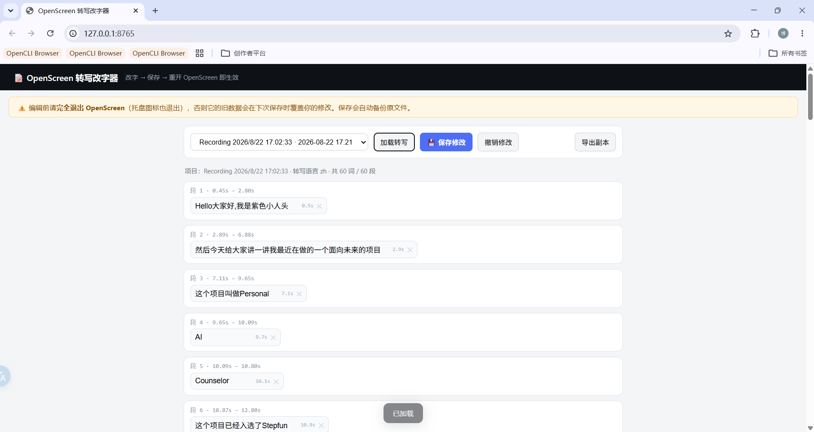

# Transcript Editor

A tiny zero-dependency helper for manually correcting the **auto-transcribed subtitle text** that OpenScreen generates.

> Whisper transcribes on-device, but it often mis-recognizes spoken words (especially Chinese names and colloquial terms), and those errors land directly in the subtitles. OpenScreen deliberately treats captions as a *derived view* of the transcript — there is no in-app UI to edit caption text directly. This helper fills that gap: it lets you edit the transcript words like a document, and the captions follow.



## What it does

- **Edit transcript words line by line.** Each token is a clean input box. Save, reopen OpenScreen, and the captions show your corrected text.
- **Auto-expanding inputs.** A long token (a whole sentence stored as one word) makes its box grow so you can read the full line without scrolling horizontally.
- **Clear junk tokens.** Whisper often emits placeholders like `(听不懂)` ("can't understand"). Click the ✕ to blank a token — it's then skipped in the captions.
- **Automatic backup.** Every save writes a `.bak-<timestamp>` beside the project file first, so a bad edit is always revertible.
- **Revert button.** Jump back to the on-disk version, discarding unsaved edits.
- **Multiple projects.** Auto-lists every project in your OpenScreen projects directory — pick one, edit, save.

## Why it exists

OpenScreen's captions are a **derived view** of the transcript (see [`src/lib/ai-edition/captions/settings.ts`](../../src/lib/ai-edition/captions/settings.ts): *"the transcript stays the single source of truth"*, *"nothing here stores caption text"*). To change caption text you change the underlying transcript words — `doc.transcripts[].words[].text`. That file (`.openscreen`) is structured JSON, and editing it by hand is both error-prone and tedious. This tool wraps that JSON in a clean per-line editing UI, so you never touch the JSON structure.

This is a **standalone helper** — it reads and writes OpenScreen's own project JSON; it does **not** modify, bundle, or fork OpenScreen itself.

## Usage

1. **Fully quit OpenScreen** first (including the tray icon). Otherwise it will write stale data back over your edits on its next save.
2. Start the tool — a browser tab opens at `http://127.0.0.1:8765`:

   ```bash
   python transcript_editor_server.py
   ```

3. Pick a project in the dropdown, click **加载转写 (Load transcript)**.
4. Edit the boxes; click ✕ to blank a junk token.
5. Click **💾 保存修改 (Save)** (auto-backup) — then reopen OpenScreen to see the corrected captions.

**Python standard library only.** No `pip install`, no Node, no npm. Works on Windows and macOS.

### Overriding the projects directory

By default the tool locates projects at `~/AppData/Roaming/openscreen/projects` (Windows) or `~/Library/Application Support/openscreen/projects` (macOS). Override with the env var `OPENSCREEN_PROJECTS_DIR` for a non-default install location:

```bash
OPENSCREEN_PROJECTS_DIR="/path/to/projects" python transcript_editor_server.py
```

## Which file it edits

- Each OpenScreen project is one `.openscreen` JSON file in its `projects/` directory.
- Caption text lives at `doc.transcripts[].words[].text` (one entry per word) and is the true source the captions render from.
- The tool edits those `words[].text` values and also syncs the matching `segments[].text`, keeping both layers consistent.

## Notes

- **Why subtitles look broken into few words?** That's OpenScreen's caption wrapping (`minWordsPerLine`/`maxWordsPerLine`), not this helper. This tool edits text only — line wrapping stays with OpenScreen's caption settings.
- The tool is intentionally narrow (YAGNI): it edits transcript text, nothing else.
